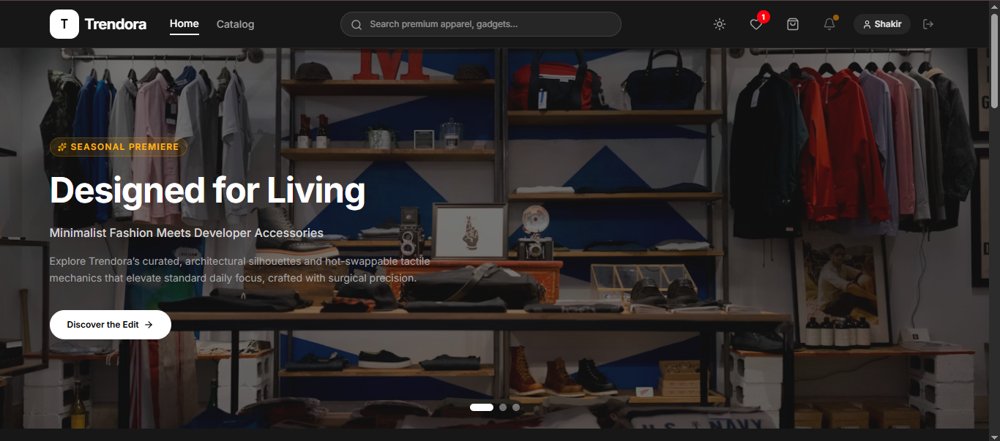

# 🛍️ Trendora — Full-Stack E-Commerce Web Application

> A complete, production-ready e-commerce platform built with React 19, Node.js, Express.js, and MongoDB. Features a full customer storefront, admin dashboard, JWT authentication, OTP-based checkout verification, and real-time notifications.

<p align="center">
  <a href="https://trendora-pi.vercel.app" target="_blank">
    
  </a>
  <a href="https://trendora-backend-ngio.onrender.com/api/health" target="_blank">
    
  </a>
  
  
  
</p>

---

## 📸 Screenshots

> **Live Demo:** [https://trendora-pi.vercel.app](https://trendora-pi.vercel.app)

| Storefront | Admin Dashboard |
|---|---|
| Browse products with filters, search, and pagination | Manage products, orders, and users with charts |

---

## ✨ Features

### 👤 Customer Features
- **Authentication** — Register, Login, Logout with JWT + HTTP-only cookies
- **Password Reset** — Secure 6-digit OTP via email (15-minute expiry)
- **Product Catalog** — Browse with search, filters (category, brand, price, color, size, rating), and pagination
- **Product Reviews** — Rate (1–5 stars) and comment on products
- **Shopping Cart** — Add items with color/size selection, update quantities, remove items
- **Wishlist** — Save products for later
- **Checkout** — 3-step process: review → shipping → payment
- **Payment Methods** — Card (simulated), PayPal (simulated), Crypto (simulated), Cash on Delivery
- **OTP Verification** — Email OTP required before every order placement
- **Order History** — Track all past orders with real-time status
- **Profile Management** — Update name and saved shipping address
- **Notifications** — Bell icon with system/order/review alerts (polls every 15s)
- **Dark / Light Mode** — Theme preference saved in browser

### 🔧 Admin Features
- **Dashboard** — Total sales, order/user/product counts, low-stock alerts
- **Sales Charts** — 7-day revenue area chart + category-wise bar chart
- **Product Management** — Add, edit, delete, bulk delete products with image upload (URL or drag-and-drop)
- **Order Management** — View all orders, update status (Pending → Processing → Shipped → Delivered → Cancelled)
- **User Management** — View users, promote/demote admin role, block/unblock accounts
- **Auto-refresh** — Dashboard updates every 10 seconds

---

## 🎨 Color Scheme

### Brand Colors
| Color | Tailwind | Hex | Usage |
|---|---|---|---|
| **Light** | `bg-white` / `text-neutral-900` | — | Light mode page background / primary text |
| **Dark** | `bg-neutral-900` / `text-neutral-100` | — | Dark mode background / primary text |
| **Accent** | `amber-500` | `#f59e0b` | Buttons, links, star ratings, icons, CTAs, range slider |
| **Success** | `emerald-500` | `#10b981` | Free shipping, success toasts, order status badges |
| **Error** | `red-500` | `#ef4444` | Error toasts, out of stock, delete actions, wishlist heart |
| **Surfaces** | `neutral-50` to `neutral-950` | — | Cards, modals, sections, footers, skeleton loaders |
| **Charts** | amber / emerald / blue / pink | `#fbbf24` `#10b981` `#3b82f6` `#ec4899` | Admin dashboard bar chart & area chart |

### Dark Mode Mapping
| Light | Dark |
|---|---|
| `bg-white` | `bg-neutral-900` |
| `bg-gray-50` / `bg-neutral-50` | `bg-neutral-950` / `bg-neutral-900` |
| `text-neutral-900` | `text-neutral-100` |
| `text-neutral-500` | `text-neutral-400` |
| `border-neutral-200` | `border-neutral-800` |

### Payment Method Colors
| Method | Header | Button |
|---|---|---|
| Card (Razorpay) | `bg-slate-900` | `amber-500` |
| PayPal | `#003087` | `#0070ba` / `#005ea6` |
| Crypto (USDT) | `bg-purple-950` | `purple-600` / `purple-700` |

---

## 🛠️ Tech Stack

### Backend
| Technology | Purpose |
|---|---|
| **Node.js** | JavaScript runtime |
| **Express.js** | REST API framework |
| **MongoDB Atlas** | Cloud NoSQL database |
| **Mongoose** | Schema modeling & ODM |
| **JWT (jsonwebtoken)** | Stateless authentication |
| **bcryptjs** | Password & OTP hashing |
| **Resend** | Transactional email (OTP delivery) |
| **Helmet** | HTTP security headers |
| **express-rate-limit** | API rate limiting (200 req / 15 min) |
| **express-mongo-sanitize** | NoSQL injection prevention |
| **express-validator** | Server-side request validation |

### Frontend
| Technology | Purpose |
|---|---|
| **React 19** | UI component library |
| **Vite** | Build tool with fast HMR |
| **Tailwind CSS v4** | Utility-first styling |
| **Recharts** | Admin dashboard charts |
| **Motion** | Animations (Framer Motion successor) |
| **Lucide React** | SVG icon library |

### Deployment
| Layer | Platform | URL |
|---|---|---|
| Frontend (Storefront) | Vercel | [trendora-pi.vercel.app](https://trendora-pi.vercel.app) |
| Backend (API) | Render | [trendora-backend-ngio.onrender.com](https://trendora-backend-ngio.onrender.com) |
| Admin Panel | Vercel | Separate Vercel project |
| Database | MongoDB Atlas | Cloud-hosted |

---

## 🏗️ Project Architecture

```
Trendora/
├── package.json              # Root — runs both servers concurrently
├── Back-end/                 # Express.js REST API
│   ├── server.js             # Entry point
│   ├── config/db.js          # MongoDB connection
│   ├── models/               # Mongoose schemas (User, Product, Order, Notification)
│   ├── controllers/          # Business logic handlers
│   ├── routes/               # API route definitions
│   ├── middleware/           # Auth, admin guard, error handler, validators
│   └── utils/                # JWT helpers, email service, cart helpers, seed script
├── Front-end/                # React + Vite storefront
│   └── src/
│       ├── context/          # Global state (React Context + useReducer)
│       ├── services/         # API service layer (fetch wrappers)
│       ├── components/       # Reusable UI (Header, Footer)
│       └── pages/            # Page components (Home, Products, Cart, Checkout, Profile, Admin)
└── Admin-panel/              # Standalone React admin panel (separate Vercel deploy)
```

---

## 🗄️ Database Schema (4 Collections)

```
users        → name, email, password (hashed), role, address, cart[], favorites[], isBlocked
products     → name, description, price, category, brand, images[], colors[], sizes[], stock, reviews[]
orders       → userId, items[], shippingAddress, paymentMethod, paymentStatus, orderStatus, totalAmount
notifications → userId (null = system-wide), title, message, type, isRead
```

---

## 🔐 Authentication Flow

```
Register  →  bcrypt hash password (10 rounds)  →  JWT (7-day expiry)  →  HTTP-only cookie
Login     →  bcrypt.compare()  →  JWT  →  HTTP-only cookie + Bearer token in memory
Protected routes  →  authMiddleware checks cookie → Authorization header → verifies JWT
```

---

## 📦 Order Flow

```
Browse → Add to Cart → Checkout (3 steps) → Mock Payment → OTP Email Verification
     → Backend: validate OTP + check stock + decrement stock + create Order + clear cart
```

---

## 🚀 Getting Started

### Prerequisites
- Node.js v18+
- MongoDB Atlas account (or local MongoDB)

### Installation

```bash
# Clone the repository
git clone https://github.com/YOUR_USERNAME/trendora.git
cd trendora

# Install all dependencies (root + backend + frontend)
npm run install:all
```

### Environment Variables

**`Back-end/.env`**
```env
MONGODB_URI=mongodb+srv://your-cluster-url
JWT_SECRET=your_super_secret_key
RESEND_API_KEY=re_your_resend_key   # optional — OTP emails won't send without it
PORT=5000
NODE_ENV=development
```

**`Front-end/.env`**
```env
VITE_API_URL=http://localhost:5000
```

### Running Locally

```bash
# Run backend and frontend together
npm run dev

# Or run separately
npm run dev:server    # API on http://localhost:5000
npm run dev:client    # Store on http://localhost:5173

# Seed the database (run once)
npm run seed
```

### Test Credentials

| Role | Email | Password |
|---|---|---|
| Admin | admin@trendora.com | Asdf@295 |
| Demo User | user@trendora.com | user123 |

---

## 📡 API Reference

### Public Endpoints
| Method | Endpoint | Description |
|---|---|---|
| `POST` | `/api/auth/register` | Create account |
| `POST` | `/api/auth/login` | Login (returns JWT + cookie) |
| `POST` | `/api/auth/forgot-password` | Request OTP for password reset |
| `POST` | `/api/auth/reset-password` | Reset password with OTP |
| `GET` | `/api/products` | List products (search, filter, paginate) |
| `GET` | `/api/products/:id` | Single product detail |
| `GET` | `/api/health` | API health check |

### Protected Endpoints (JWT Required)
| Method | Endpoint | Description |
|---|---|---|
| `GET` | `/api/auth/me` | Get current user |
| `PUT` | `/api/auth/profile` | Update profile |
| `GET/PUT` | `/api/cart` | Get / save cart |
| `GET/PUT` | `/api/wishlist` | Get / save wishlist |
| `GET` | `/api/orders` | Order history |
| `POST` | `/api/orders/request-otp` | Request checkout OTP |
| `POST` | `/api/orders` | Place order (OTP required) |
| `POST` | `/api/products/:id/reviews` | Add product review |

### Admin Endpoints (Admin Role Required)
| Method | Endpoint | Description |
|---|---|---|
| `GET` | `/api/admin/stats` | Dashboard statistics |
| `GET/POST/PUT/DELETE` | `/api/admin/products` | Full product CRUD |
| `GET/PUT` | `/api/admin/orders` | View / update orders |
| `GET/PUT` | `/api/admin/users` | Manage users |

---

## 📄 License

This project was built as a **Final Year Project** for academic purposes.

---

<p align="center">Built with ❤️ using React, Node.js, Express & MongoDB</p>
